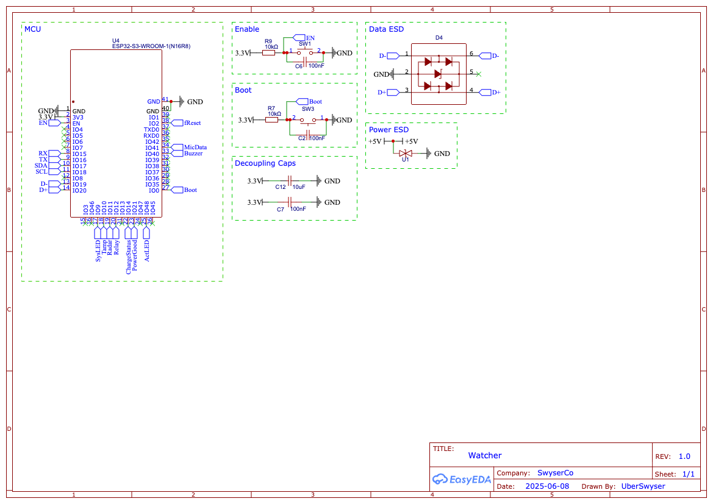
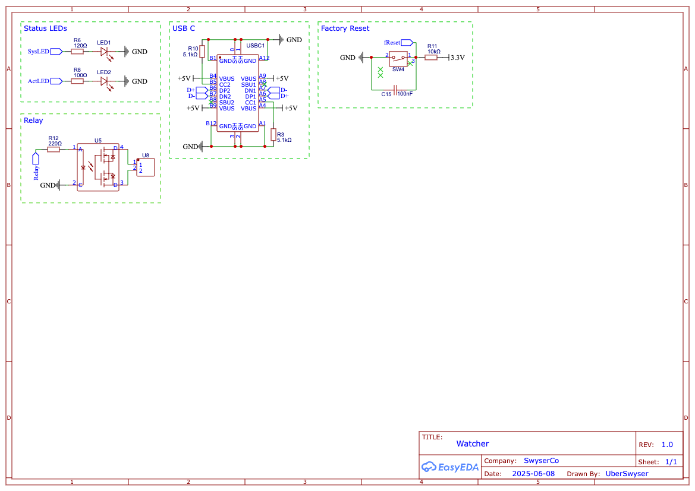
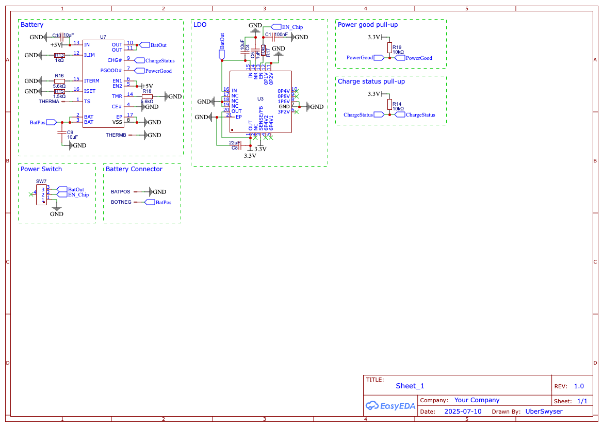
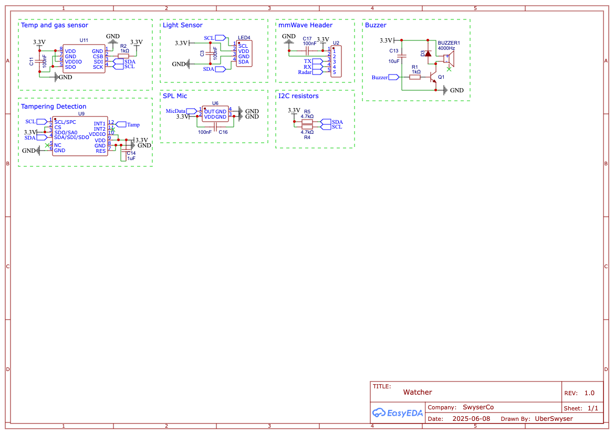

# Guardian Security System – The Scout Device

## Introduction
Over the past year, I’ve been immersing myself in the world of electronics. As a beginner, I’ve spent countless hours watching tutorials, following guides, and staying up to date with the latest developments in the field. This journey has led me to embark on an ambitious project: designing and building a custom home security system called **Guardian**.

Guardian is envisioned as a modular ecosystem of smart devices that work together to provide security and automation. While this document focuses on **The Scout**, the system also includes **The Keep**—a central control panel—and **Hearthstone**, a custom-designed power supply module. Together, these components form a cohesive and scalable platform for home security and automation.

My goal is to first implement Guardian in my own home, and eventually develop it into a certified product that can be sold online. The system is designed to be modular, scalable, and deeply integrated with smart home platforms like Home Assistant.

## The Scout
The Scout is a compact, sensor-rich device measuring 44mm x 44mm. It is designed primarily for presence detection using a **LD2420 mmWave sensor**, and also serves as a general-purpose sensor node for broader home automation tasks.

### Sensors and Components
The Scout integrates a variety of sensors to monitor environmental and physical conditions:

- **LD2420** – mmWave sensor for presence detection  
- **BME280 (C92489)** – Measures temperature and air quality  
- **VEML7700 (C504893)** – Ambient light sensor  
- **Omnidirectional Digital MEMS Microphones (C5373233)** – Detects sound  
- **Accelerometer (C189624)** – Tamper detection  
- **Passive Electromagnetic Buzzer (C96256)** – Audible alerts for movement  
- **Relay (C146360)** – Capable of switching up to 300V  

### Power Management
The Scout is primarily powered via USB, but includes a 1800mAh battery as a backup in case of power outages. This battery is expected to provide:

- ~34.6 hours of runtime in idle mode  
- ~4.4 hours of runtime under peak load  

Power components include:

- **BQ24074RGTR (C54313)** – Battery and power path management  
- **TPS7A4700RGWR (C114839)** – LDO regulator (up to 1A output, under evaluation)  

### User Interface and Controls
To provide feedback and control, the Scout includes:

- **LEDs (C965817 and C965812)** – Indicate system status and activity  
- **Tactile Switches** – Connected to EN pin, boot select, and a dedicated factory reset function  
- **Slide Switch** – Controls power via the buck converter  

### Protection
To ensure safe operation and protect sensitive components:

- **ESD Protection (C7519)** – Connected between the USB-C port (C165948) and the ESP32’s data lines  

### Microcontroller and Connectivity
All Guardian devices, including The Scout, are built around the **ESP32-S3-WROOM-1** microcontroller. The Scout connects to the home network via Wi-Fi and remains active at all times. While Bluetooth is available, its role in the system is yet to be defined.

### Software and Integration
The Scout will interface with **Home Assistant**, using custom firmware developed in the **Arduino IDE**. A custom **WiFiManager** implementation is planned to simplify setup for end users. Support for **OTA updates** is also being explored to enable remote firmware upgrades.

### Prototyping and Manufacturing
Initial prototypes will be housed in custom enclosures produced using an **SLA resin printer**, allowing for precise dimensioning before outsourcing production. The PCB design is currently underway, featuring a 4-layer stackup: Signal, Ground, Power, Signal. Manufacturing will be handled by **JLCPCB**, whose capabilities are outlined here.

All components mentioned are available from **LCSC**, ensuring accessibility and consistency in sourcing.

### Pin Mapping

| Function                  | GPIO Pin |
|---------------------------|----------|
| Factory Reset Button      | IO02     |
| LD2420 RX                 | IO15     |
| LD2420 TX                 | IO16     |
| I2C SDA                   | IO17     |
| I2C SCL                   | IO18     |
| USB D+                    | IO19     |
| USB D-                    | IO20     |
| System LED                | IO09     |
| Accelerometer Interrupt   | IO10     |
| LD2420 Interrupt          | IO11     |
| Relay                     | IO12     |
| Charged Status            | IO14     |
| Power Good                | IO21     |
| Activity LED              | IO48     |
| SPL Microphone            | IO41     |
| Buzzer                    | IO40     |

## Schematics and Visuals
The following section is reserved for schematic and layout images. These will be added once available.

### Main

### Peripherals

### Power

### Sensors

